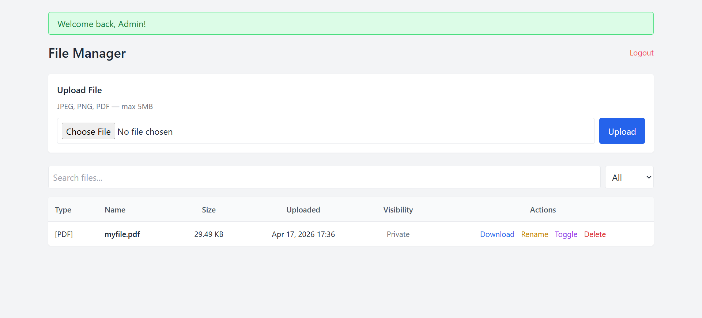

## Introduction

A simple file management web application built with PHP and MySQL, developed as a 
project to demonstrate backend web structure and logic such as MVC architecture, user
authentication, file handling, and security practices.



---

## Main Ideas

- Backend development with PHP and MySQL using PDO
- MVC-like project structure with separated concerns
- User authentication with session management
- Secure file upload, storage, and retrieval
- REST-like controller routing without a framework

---

## Features

- User registration and login with hashed passwords
- File upload with MIME type validation and size limit (5MB by default)
- File download, rename, and delete
- Public/private visibility toggle with shareable link via secure token
- Real-time search and filter by file name and file type
- Pagination for file listing
- Flash messages for feedback on all user's actions
- Allowed file types: JPEG, PNG, PDF

---

## Security Practices

- Passwords hashed with `password_hash()` / `password_verify()` (bcrypt)
- PDO prepared statements to prevent SQL injection
- `htmlspecialchars()` on all output to prevent XSS
- Server-side MIME type detection with `finfo_file()` to prevent spoofed file types
- Session-based authentication with ownership verification on all file actions
- Share tokens generated with `random_bytes()` for more cryptographically secure

---

## Setup

### Requirements
- XAMPP (or any Apache + PHP + MySQL stack)
- PHP 8.0 or higher
- MySQL / MariaDB

### Steps

**1 — Clone the repo**
```bash
git clone https://github.com/DO-ON-TRI-QUAN/PHP_File_Management.git
```

**2 — Set up the database**

Open phpMyAdmin at `http://localhost/phpmyadmin` and import the schema:
Database → Import → select file_manager.sql → Go
. Or run via MySQL CLI:
```bash
mysql -u root -p < file_manager.sql
```

**3 — Configure the database connection**

Copy the example config:
```bash
cp config/database.example.php config/database.php
```
Then edit `config/database.php` to fill in your actual credentials:
```php
$host = 'localhost';
$db   = 'file_manager';
$user = 'your_db_username';
$pass = 'your_db_password';
```

**4 — Configure Apache document root**

Point your Apache document root to the project folder, or place the project in your
XAMPP `htdocs` directory. Then access the app at:
http://localhost/public/

---

## Room for Improvements

- User profile page for changing username, email, password
- Admin panel for managing all users and files
- Additional file types, currently limited to JPEG, PNG and PDF
- File preview, for example image thumbnails and PDF preview in browser
- Drag and drop upload
- Storage quota per user

---

## Built With

- PHP 8.2.12
- MySQL / MariaDB
- Tailwind CSS (via CDN)
- Vanilla JavaScript
- XAMPP (local development)

---

## Project Structure

```
PHP_File_Management/
├── config/
│   ├── database.php            — PDO connection (local only, not in repo)
│   └── database.example.php    — example config with placeholder credentials
├── controllers/
│   ├── AuthController.php      — handles register and login
│   └── FileController.php      — handles upload, download, delete, rename, visibility
├── models/
│   ├── UserModel.php           — database interactions for users table
│   └── FileModel.php           — database interactions for files table
├── views/
│   ├── login.php               — login page
│   ├── register.php            — register page
│   └── home.php                — home page with file table, file actions and modals
├── utils/
│   ├── flash_messages.php      — set and get session flash messages
│   └── helpers.php             — for better file display formatting
├── assets/
│   ├── css/
│   │   └── global.css          — global styles
│   └── javascript/
│       ├── modal.js            — modal open, close, and dynamic form actions
│       └── search.js           — real-time file search and filter
├── public/
│   └── index.php               — entry point and router
├── uploads/
│   └── .gitkeep                — holds uploaded files on disk, tracked by git while empty
└── file_manager.sql            — database schema

```

